# MH Monsters Elements

## First note

This is a very old project (and not maintainted) I developped long ago when I was playing **Monster Hunter Tri Ultimate** on Wii U.<br/>
I updated it a bit when I started to play Monster Hunter 4.

The original documentation (HTML) can be found **[here](http://htmlpreview.github.io/?https://raw.githubusercontent.com/TanukiSharp/MHMonstersElements/master/Documentation/doc.html "The original documentation")**.<br/>
This markdown is a manual translation of the former.

This has been developped in C# and WPF with Visual Studio 2012.

## Overview

MH Monsters Elements is an application to find the best element of one or several monsters, and thus determine the best weapon to use.<br/>
It does not make much sense to use it to fight one monster, however, fighting several ones in the same quest could become tricky to determine the best element to use.

When you run the application, it shows all monsters without any filtering, and thus you can see it as the following:

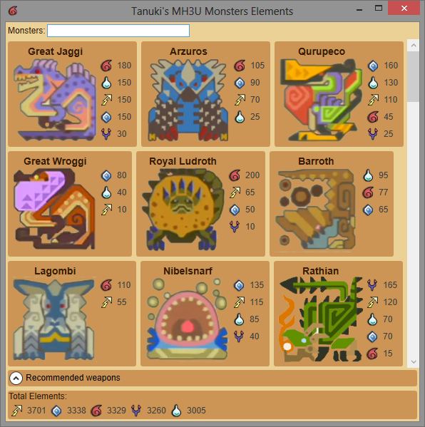

This document is bit long, and maybe you do not want to read all, so just read the Elements section, as long as it's the most important and probably not intuitive.<br />
For the <a href="#filtering">Filtering</a> and <a href="#recommended_weapons">Recommended Weapons</a> sections, if you do not want to read, just type in the 'Monsters:' text box and you should get it quickly.<br />
Separate monster names with semi-colon symbol (;) or coma symbol (,) if you want to filter many, and use the equal sign (=) before a monster's name to match the exact name.

## Elements

Each monster has some elements beside it's icon. These are the sums of the weakness of all parts to the corresponding elements.<br/>
Some monsters have weakness to all elements, like the Rathian, some have weakness to some of the elements, but not all, like the Lagombi.

As you can see on the image above, the Rathian is most weak to 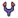 with 165 points, and then to the 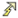 with 120 points.<br />
The fact a monster has X in  and half of X in  does not mean  will make twice more damage than , as long as the damage formula is more complex than that, but the  will be more efficient.

At the bottom most of the window, there is another list of elements, these are the sum element weaknesses of all the monsters listed in the main part of the window.<br />
So you can see that, the element the monsters (again, it does not make that much sense with all monsters listed) are the most weak are, in the following order: , then , then , then  and finally .<br />
The interest of this application is to be able to isolate the monsters you are interested in, and see the best element to use.

## Filtering<span id="filtering"></span>

The interest of MH Monsters Elements application is that you can isolate one or several monsters, and I will explain how to do that right now.<br/>
At the top of the window, there is a text field entitled 'Monsters:' so here you can type the name (or a part of the name) of a monster and it will be filtered.<br/>
I know some would have prefer a click-based system with check boxes, but text-based is actually the most efficient, trust me.

First, you have to know that the typing is <em>case insensitive</em>, which means you can type with upper case or lower case letters, it does not matter.

If you type 'rath' in the text box, all the monsters containing 'rath' in their name appear, so the three Rathians and the three Rathalos appear, as shown in the image bellow.

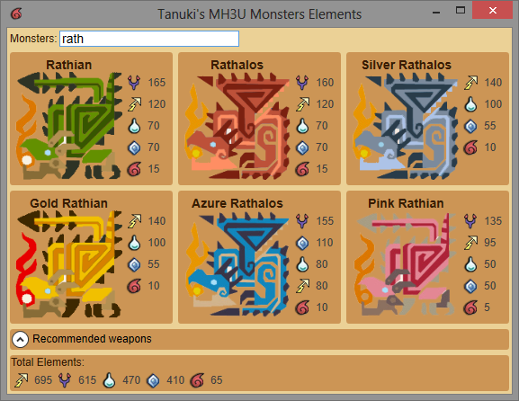

We can see that the most interesting element in that case is .<br/>
However, we rarely (never?) fight these 6 monsters in the same quest, so we want to enrich the filter to match a better subset.<br/>
Inputing 'ratha' in the text box excludes the Rathians, and thus only the three Rathalos remain, as shown in the image bellow.

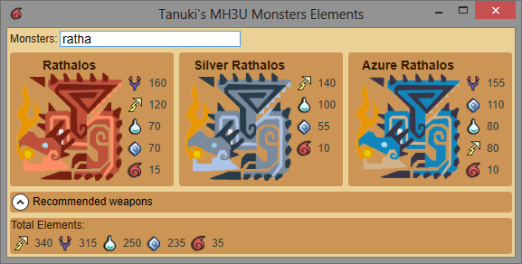

So if you go to a quest where you have to fight the three different kind of Rathalos, you probably would like to take a , or  weapon.<br/>
Anyway, for sure you do not want to take a  weapon.

If you want to see only the Azure Rathalos, you do not have to type its name entirely, you can just type 'azu', as long as this is the only monster which contains 'azu' in its full name.

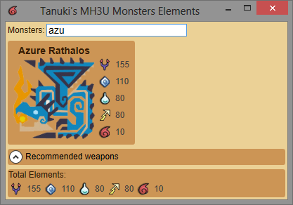

In this case, the total elements summary at the bottom of the window matches the monster's element weakness list.

What if you want to see only the Rathalos?<br />
Typing 'rathalos' even completly would show all the monsters containing the word 'rathalos' in their full name, thus including the Azure and Silver ones.<br />
The way to workaround it is to add an equal symbol '=' before the text you are looking for, which means 'do not match monsters <u>containing</u> the text but the one that <u>is equal to</u> the text'.<br/>
So, if you type '=rath' then no monster is displayed, because there is no monster the name is equal to 'rath'.

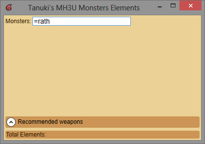

Typing the name 'rathalos' after the equal sign '=' makes the Rathalos, and only it, to appear, as shown in the image bellow.

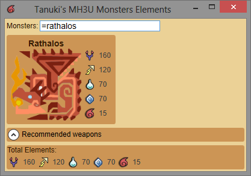

Most of time, you want to filter several monsters, but not the same species, so hereafter is how to combine filters.<br />
Type several monster name separated by coma symbol (,) or semi-colon symbol (;), as follow:

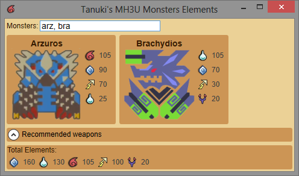

This shows the Arzuros and the Brachydios together, and at the bottom of the window, the best element to use to fight these monsters together.<br />
As you can see, the  element is the best to chose.<br />
Or maybe  because it deals more damages to the Brachydios, and not so much to the Arzuros but this is an easy monster.<br />
So you can feel free to ponderate the result, as long as the application do not take the threat level of the monster into account. Maybe in a future version.


Finally, you can combine filters with and without the equal sign, independently per filter.<br />
Type '=rathalos, bra' and thus the application will match a monster where the name is equal to 'rathalos' and all monsters where the name contains 'bra'.<br />
In the end, you get the Rathalos and the Brachydios, as long as only these two monsters match the filter.

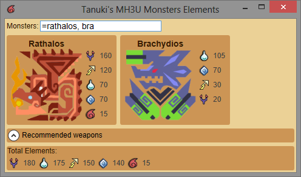

In this case, you can see that  element is the best one globally.<br />
However, if you look at it locally, it is very good for the Rathalos, but very bad for the Brachydios, so in this case  seems to be a better choice.

## Recommended weapons<span id="recommended_weapons"></span>

### Overview

Another feature of the application is to try to tell you what is the best weapon to use.<br />
This is done by setting a list of available weapons (namely the best weapons you own) and the application resolves a damage formula for each weapon, and tells you the three weapons that return the best total amount of damage, per weapon type.<br />
The formula used is a simplified version of the real formula and will be discussed later.<br />
At the bottom of the window, above the frame that shows the total elements, there is a folded frame entitled 'Recommended weapons'. You can click it to fold or unfold it.<br />
It shows the best weapons to use according to the filtered monsters, and thus it changes according to what you type as filter.

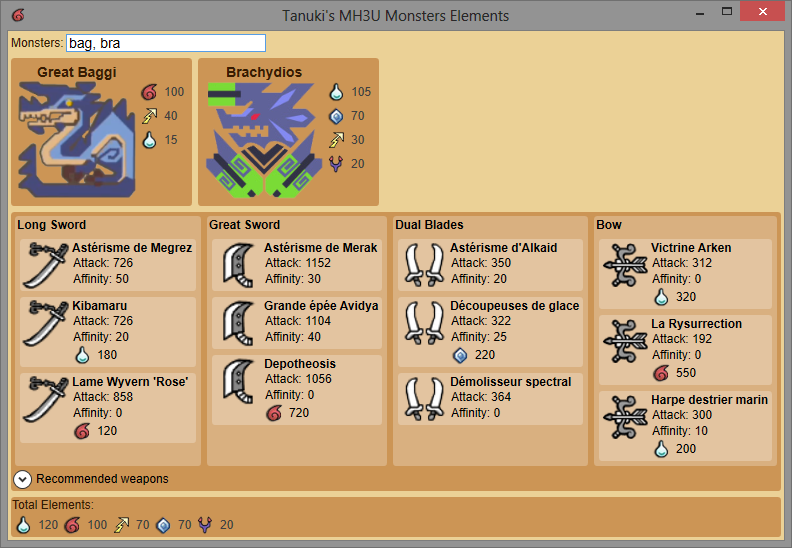

The list of weapons provided by default contains most of the best Great Swords, Long Swords, Bows and Dual Swords, and the names are in French, sorry about that.<br />
Anyway, the goal of the available weapons is for <u>you</u> to set the ones you own, so I recommend you to edit the weapons.<br />
To do so, there is a file at the root level of the MH Monsters Elements application named 'weapons.xml', this is the file you will have to edit.<br />
If you want to organize your wepons per file, you can do so by adding files, but their name (filename) must start with 'weapon' and have the '.xml' extension.<br />
For exemple, having weapon_gs.xml, weapon_ls.xml, weapon_ds.xml, and so on is a good idea.

The file contains the following markups:

```XML
<?xml version="1.0" encoding="utf-8"?>
<Weapons>

    <GreatSword Name="Brunnhilde" Raw="1200" Sharpness="White"/>
    <GreatSword Name="Depotheosis" Raw="1056" Element="720" Affinity="0" ElementType="Fire" Sharpness="Purple"/>
    ...

    <LongSword Name="Astérisme de Megrez" Raw="726" Affinity="50" Sharpness="Purple"/>
    <LongSword Name="L'Adjudition" Raw="693" Element="500" Affinity="0" ElementType="Fire" Sharpness="Purple"/>
    ...

    <DualBlades Name="Astérisme d'Alkaid" Raw="350" Affinity="20" Sharpness="Purple"/>
    <DualBlades Name="La Fistolution" Raw="280" Element="450" Affinity="0" ElementType="Fire" Sharpness="Purple"/>
    ...

    <Bow Name="La Rysurrection" Raw="192" Element="550" ElementType="Fire"/>
    <Bow Name="Altheos Incanonis" Raw="364" Element="380" ElementType="Dragon"/>
    ...

</Weapons>
```

So you can add or remove weapons by following the sample above.<br />
You must respect a proper syntax when you write a weapon information, otherwise it will be considered as invalid by the application.

### Node markup

The node markup name for weapons are as follow:

- GreatSword
- LongSword
- SwordAndShield
- DualBlades
- Hammer
- HuntingHorn
- Lance
- Gunlance
- SwitchAxe
- LightBowGun
- HeavyBoxGun
- Bow

### Attributes markup

The attributes on each weapon node are:

- Raw
    - Mandatory.
    - This is the raw damage of the weapon.
- Affinity
    - Optional.
    - This is the affinity of the weapon.
- Element
    - Optional.
    - This is the element damage of the weapon.
- ElementType
    - Optional.
    - This is the type of element of the weapon, the possible values are as follow:
        - Fire
        - Water
        - Ice
        - Thunder
        - Dragon
- Sharpness
    - Optional. The default value is Green.
    - This is the maximum sharpness of the weapon.<br />
    At Sharpness +1 or not is up to you, but input all your weapon information based on the same standard.
    - The possible values are as follow:
        - Red
        - Orange
        - Yellow
        - Green
        - Blue
        - White
        - Purple

### Damage formula

The damage formula used to determine the best weapon is as follow:

RawDamage = Raw * Affinity * RawSharpnessMultiplier / WeaponClassMultiplier<br />
ElementalDamage = Element * ElementalSharpnessMultiplier * MonsterElemement / 10<br />
Damage = RawDamage + ElementalDamage

The formula has been simplified because, what is important is not the exact amount of damaged dealt, but just to compare the amounts of damage dealt by each weapon.<br />
Thus, for exemple, the attack move type or monster part target can be removed from the equation because they are the same no matter what weapon you use.

**Note:** For the bow, the RawDamage in the forumla is multiplied by 0.225 (almost divided by 4) because, the bow deal raw damage per arrow (* 1.5) then per charge type (* 1.5 average) then arrow multiplier (* 0.1 average)<br />

**Note:** I never played bowguns, so there is no specific support for these weapons.
